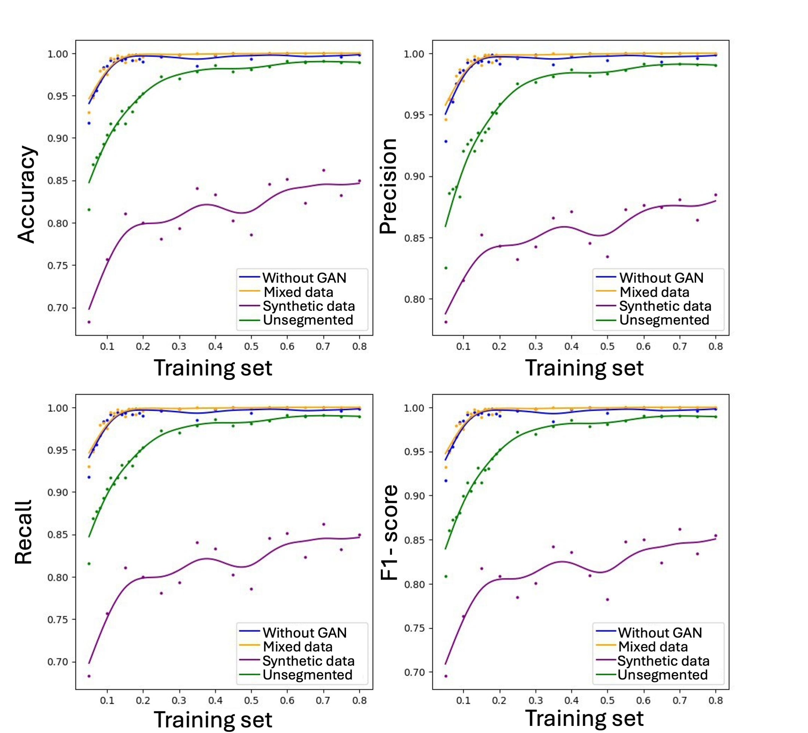
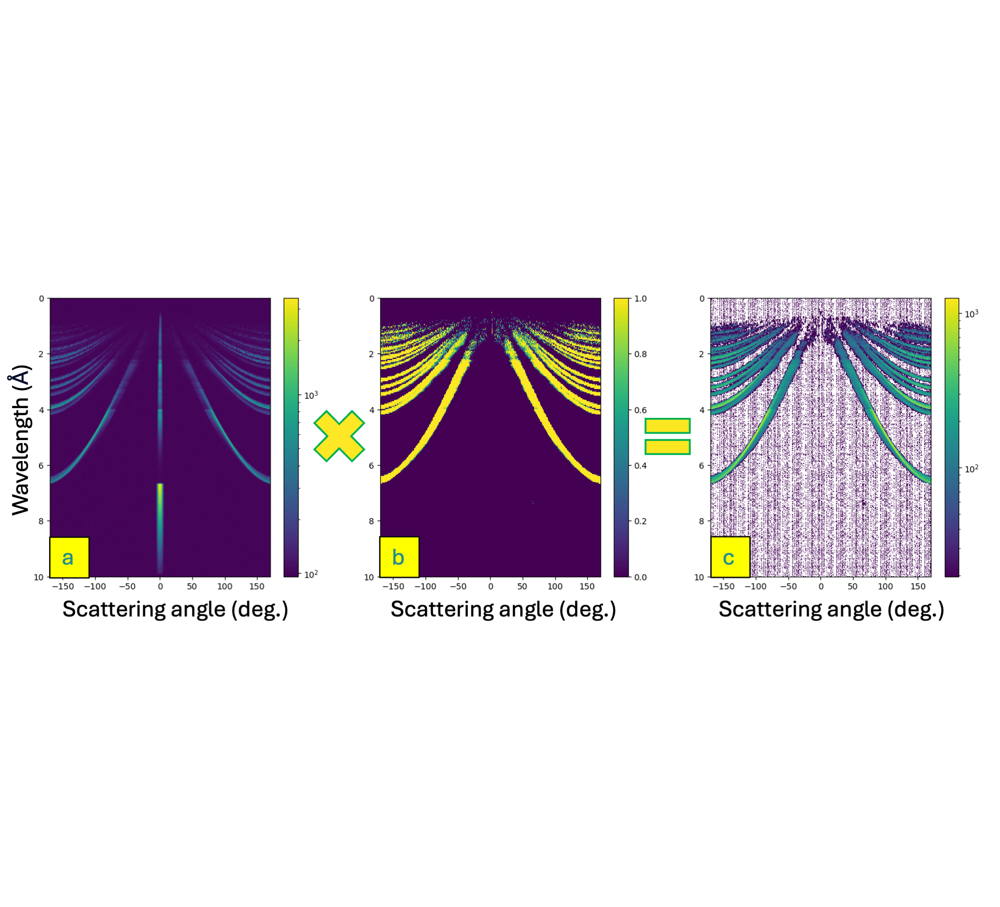
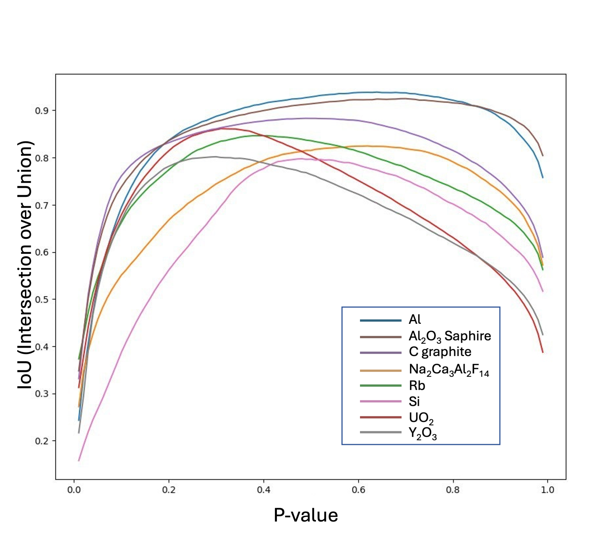
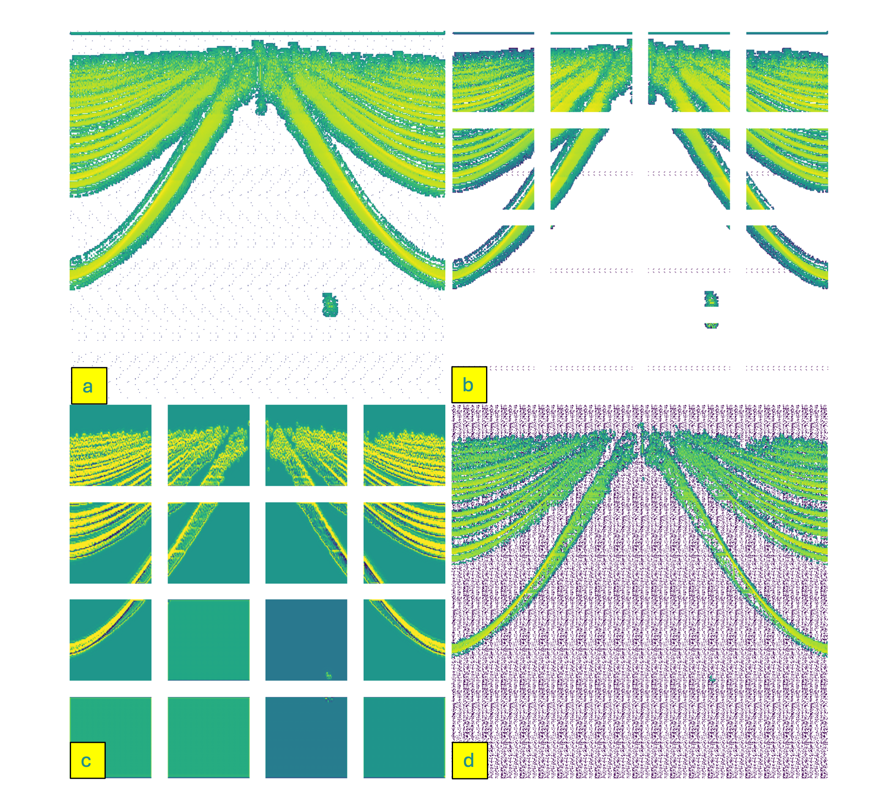
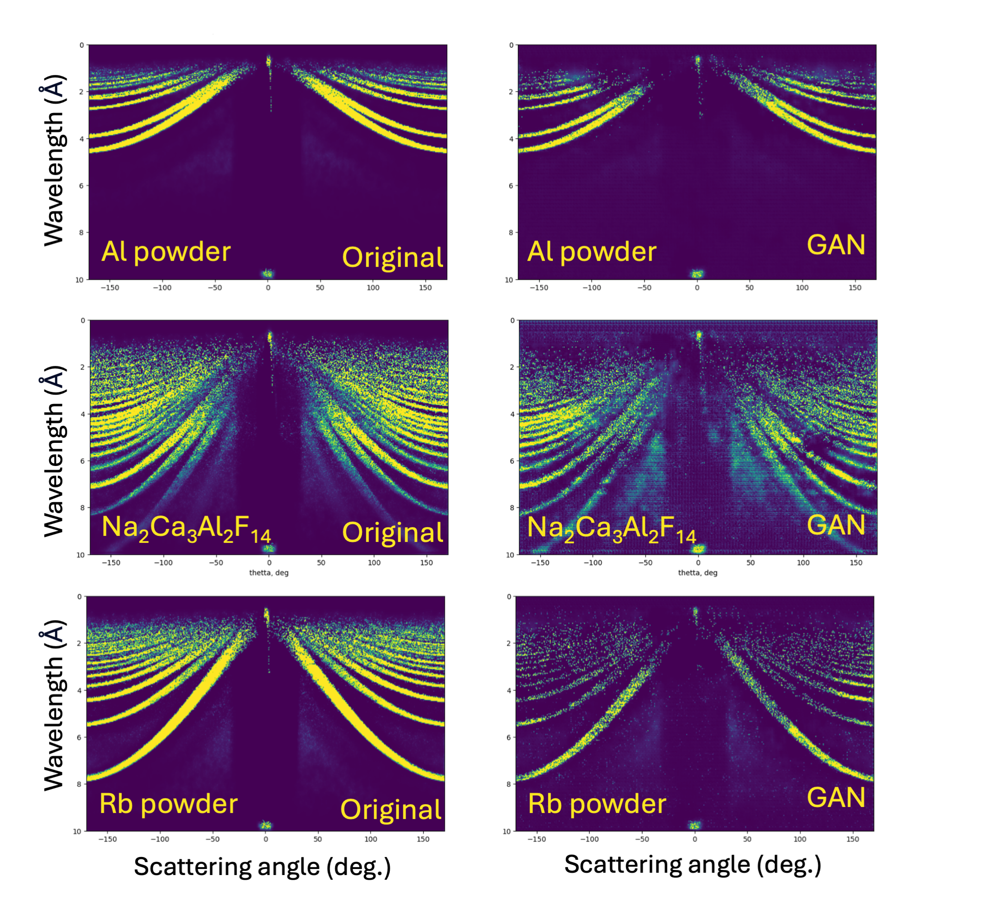
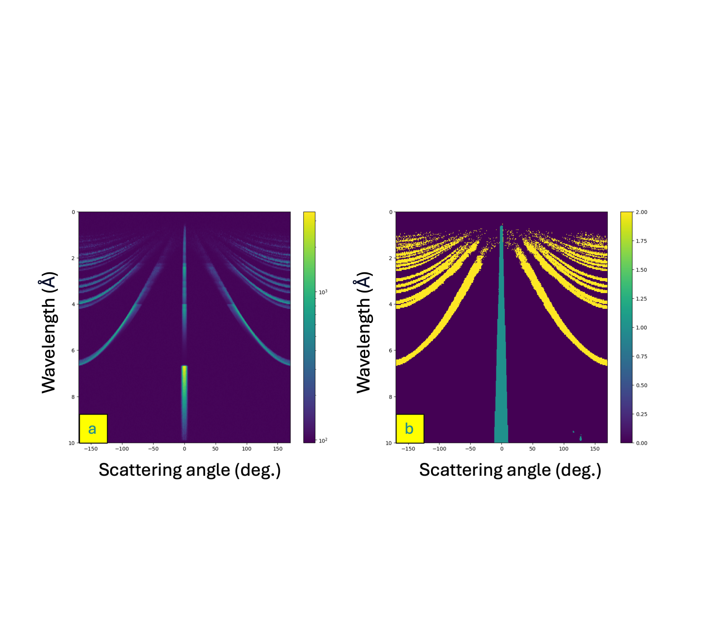
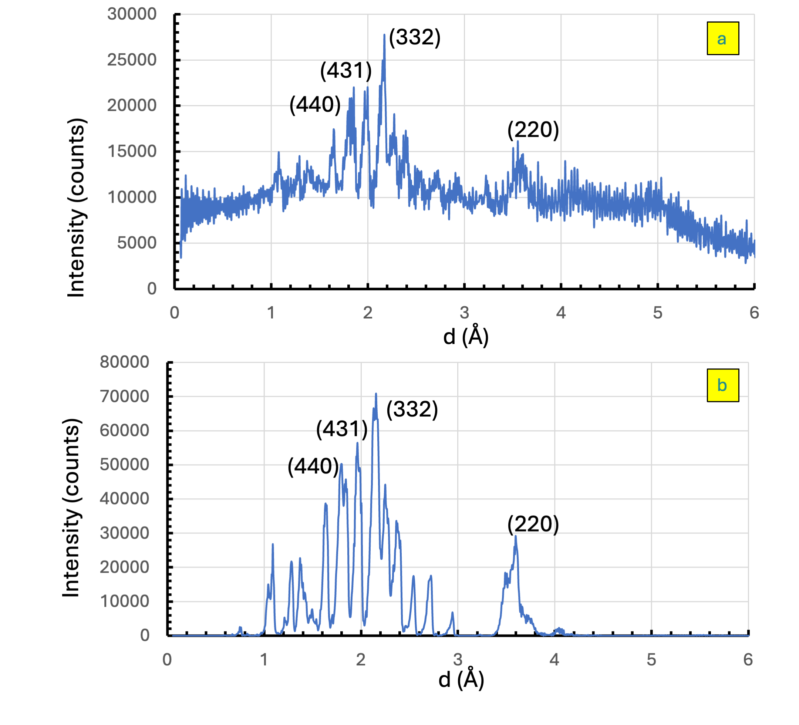

# Deep Learning Framework for 2D TOF Neutron Diffraction Analysis

This repository contains materials, code, and datasets related to the article:

**Deep Learning Framework for 2D TOF Neutron Diffraction Analysis: Classification, Neutron Intensity Enhancement, and Synthetic Data Generation**  
_A. Popov, N. Antropov, E. Kravtsov, A. Smirnov, I. Novoselov, D. Maksimov_  
M.N. Mikheev Institute of Metal Physics (IMP UB RAS), Ural Federal University, Institute of High Temperature Electrochemistry  
_April 21, 2025_

---

## 📖 Overview

This project introduces a deep learning–based framework for **refinement and post-processing of 2D time-of-flight (TOF) neutron diffraction images**.  
The framework integrates modern convolutional neural network architectures to address the following tasks:

- **Classification** of diffraction patterns using **ResNet-18**  
- **Segmentation, background filtering, and beam removal** using **U-Net**  
- **Resolution upscaling and intensity enhancement** using **SuperResolutionCNN**  
- **Synthetic data generation** with a **Conditional GAN (cGAN)**  

---

## 🧩 Neural Network Architectures

### 🔹 ResNet-18
- Used for **classification of diffraction patterns** into crystalline structures  
- Transfer learning with ImageNet weights  
- Adapted for neutron diffraction periodicity and monochromaticity  
- Metrics: **Accuracy, Precision, Recall, F1-score**


*Figure 1. Dependence of Accuracy, Precision, Recall, and F1-score metrics on the training dataset size. Blue – segmented original dataset; Orange – segmented original dataset with (also segmented) synthetic diffraction patterns; Green – non-segmented original diffraction patterns; Purple – fully synthetic data.

### 🔹 U-Net
- Performs **semantic and binary segmentation**  
- Separates diffraction peaks, background, and direct beam  
- Enables targeted noise reduction


*Figure 2. C graphite diffraction Semantic Segmentation. (a) - Original diffraction; (b) - Segmentation map (where the direct beam, background, and diffraction pattern are separated.)


*Figure 3. C graphite diffraction binary segmentation. (a) - Original diffraction; (b) - Probability distribution for diffraction class derived from semantic segmentation; (c) - diffraction after filtering.

### 🔹 SuperResolution CNN
- Doubles diffraction image resolution (480×250 → 960×500)  
- Reduces peak broadening in reciprocal space  
- Trained on pseudo-data generated from cleaned patterns


*Figure 4. Intensity enhancement visualization. Left panel (a) shows the original 480×250 pixel image; right panel (b) displays the upscaled result (960×500 pixels).

### 🔹 Conditional GAN (cGAN)
- Generates synthetic diffraction patterns parameterized by:
  - **Crystal type** (categorical embedding)
  - **Beam statistics** (numeric features)  
- Enhances datasets for training deep models under data scarcity  
- Metrics: **PSNR = 16.15 dB, SSIM = 0.64, Classifier Accuracy = 0.96**


*Figure 5. Comparison of the original (left) and generated (right) diffraction patterns for Al, Na2Ca3Al2F14, and Rb powders.

---

## ⚙️ Processing Pipeline


*Figure 6. Visualization of the sequence of neural network filter applications for improving diffraction quality. (C-graphite)

The diffraction post-processing algorithm consists of:

1. **Semantic Segmentation** – U-Net separation into classes  
2. **Binary Segmentation** – filtering with probability masks  
3. **Resolution Upscaling** – SuperResolutionCNN  
4. **Precision Filtering** – U-Net block-wise refinement  
5. **Convolution in d-space** – conversion into reciprocal lattice representation  

---

## 📊 Results


*Figure 7. Results of applying the stack of processing algorithms. (a) - Na2Ca3Al2F14 powder diffraction; (b) - Diffraction after binary segmentation and first U-net filtration; (c) - Resulting diffraction after resolution upscaling and second U-net filtration; (d);(e);(f); - Their corresponding convolutions in d-space.

- **Noise reduction** in raw diffraction patterns  
- **Enhanced separation** of weak diffraction peaks  
- **Improved classification** accuracy with synthetic data augmentation  
- **GAN-generated patterns** are indistinguishable from experimental ones by ResNet-18

| Metric | Value | 95 % CI |
|--------|-------|-------|
| PSNR   | 17.213 dB | [17.101, 17.323] |
| SSIM   |  0.693 | [0.690, 0.697] |
| Classifier Accuracy | 0.978 | [0.973, 0.983] |
| Precision | 0.985 | [0.973, 0.983] |
| Recall | 0.978 | [0.973, 0.983] |

---

## 📂 Repository Structure

```
.
├── datsets/                           # Example diffraction datasets
├── models/                            # Implemented ResNet, U-Net, SuperResolutionCNN, GAN and others
├── results/                           # Figures and processed diffraction images
├── GAN/                               # Everything related to GAN
├── main.py                            # Main file do run Monte-Carlo simulation
├── Diffraction_generation_script.py   #Diffractometer Configuration
├── mcinstr.ipynb                      #Diffractometer Configuration
├── resnet_custom.ipynb                #Classifier development
├── Unbalanced_classifier.ipynb        #Classifier testing on an imbalanced dataset
├── 3_class_segmentation.ipynb         #Development of segmentation models
├── new_segmentation.ipynb             #Development of segmentation models
├── seg_map_df_creator.ipynb           #Creating a dataset of segmented diffractions
├── IoU_test.ipynb                     #Testing segmentation models
├── embedding_crystal.ipynb            #Development of embeddings for crystal labels
├── DiffQ.py                           #Convolution of 2D diffraction into d space
└── README.md                          # Project description
```

## 📑 Citation

If you use this repository, please cite:

```
Popov, A., Antropov, N., Kravtsov, E., Smirnov, A., Novoselov, I., & Maksimov, D. (2025).
Deep Learning Framework for 2D TOF Neutron Diffraction Analysis: Classification,
Neutron Intensity Enhancement, and Synthetic Data Generation.
M.N. Mikheev Institute of Metal Physics, Ural Federal University, Institute of High Temperature Electrochemistry.
```

---

## 🙏 Acknowledgments

- Ministry of Science and Higher Education of the Russian Federation (Project “Spin” 22021000036-3)  
- Agreement no. 075-10-2021-115 dated October 13, 2021 (15.SIN.21.0021)

---

